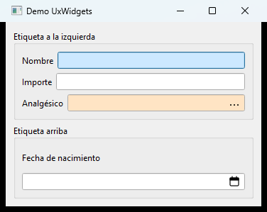
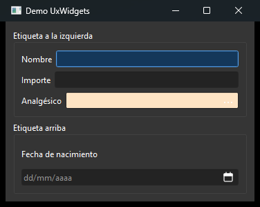

<div align="center">

# UxWidgets

**Controles Qt Widgets reutilizables para formularios de entrada de datos.**

Un control de entrada compuesto y configurable —etiqueta + campo tipado + icono—
en una sola línea de código, con validación, resaltado del campo activo y
propiedades listas para el diseñador.

[](LICENSE)


</div>

<div align="center">

| Tema claro | Tema oscuro |
|:---:|:---:|
|  |  |

<sub>El campo con el foco se resalta en azul (claro u oscuro según el tema); el campo requerido y vacío se avisa en bisque.</sub>

</div>

---

`UxWidgets` empaqueta el patrón "etiqueta + campo + icono" que se repite cientos de
veces en los formularios de una aplicación de escritorio. En vez de crear, alinear y
validar tres widgets por cada dato, colocas **un** control que ya sabe comportarse
como texto, número o fecha.

## ✨ Características

- 🧩 **Control compuesto** — etiqueta, campo e icono como una sola unidad; la
  etiqueta se coloca a la izquierda o arriba.
- 🔤 **Tres sabores tipados** — texto (con longitud máxima y mayúsculas), número
  (dígitos enteros/decimales y separador de miles) y fecha (`dd/MM/yyyy`).
- 📅 **Fecha tolerante a vacío** — sobre `QLineEdit`, admite el campo vacío cuando no
  es obligatorio (algo que `QDateEdit` no permite) y ofrece un calendario emergente.
- 🔎 **Botón selector integrado** — un icono dentro del campo que abre tu diálogo de
  elección; tú decides qué mostrar y qué devolver.
- 🎯 **Resaltado del campo activo** — el campo con el foco tiñe su fondo, con color
  **adaptado al tema** (claro/oscuro) y actualizado si el tema cambia en caliente.
- ⚠️ **Aviso de campo requerido** — resalte visual cuando un campo obligatorio
  está vacío.
- 🎛️ **Todo configurable por `Q_PROPERTY`** — preparado para un futuro plugin de
  Qt Designer sin rediseñar los controles.
- 📦 **Sin dependencias** más allá de Qt 6 y C++17.

## 🧱 Anatomía de un control

```
   ┌──────────────────────────────────────────────┐
   │  UxInput  (una sola cosa que colocas)        │
   │  ┌─────────┐ ┌──────────────────┐ ┌────────┐ │
   │  │ Etiqueta│ │  campo de texto  │ │   …    │ │
   │  └─────────┘ └──────────────────┘ └────────┘ │
   │    QLabel        UxCampo            selector │
   └──────────────────────────────────────────────┘
```

Arquitectura en dos capas: los controles heredan de widgets estándar de Qt.

```
              QLineEdit                              QWidget
                  │                                     │
            ┌─────┴─────┐                        ┌──────┴──────┐
            │  UxCampo  │  (común)               │   UxInput   │  (compuesto)
            └─────┬─────┘                        │ QLabel +    │
      ┌───────────┼───────────┐                  │ UxCampo* +  │
 UxCampoTexto UxCampoNumero UxCampoFecha         │ layout      │
                                                 └──────┬──────┘
                                           ┌────────────┼────────────┐
                                      UxInputTexto  UxInputNumero  UxInputFecha
```

- **Capa de campo** (`UxCampo : QLineEdit`): comportamiento común (botón selector,
  requerido, resaltado de foco) + la validación propia de cada tipo.
- **Capa compuesta** (`UxInput : QWidget`): etiqueta + campo + layout y reenvío de
  propiedades. Las conveniencias `UxInput{Texto,Numero,Fecha}` crean el campo del
  tipo adecuado.

## 📋 Requisitos

- **Qt 6** (Core, Gui, Widgets)
- **C++17**
- **CMake ≥ 3.21**

> Probado con Qt 6.8.3 y MinGW (GCC) en Windows. Al ser Qt Widgets portable, debería
> compilar en cualquier plataforma con Qt 6. El despliegue autocontenido de la demo
> (`windeployqt`) es específico de Windows.

## 🚀 Uso rápido

Añade la librería a tu proyecto CMake y enlaza el target:

```cmake
add_subdirectory(ruta/a/UxWidgets)
target_link_libraries(MiApp PRIVATE UxWidgets::UxWidgets)
```

```cpp
#include <UxWidgets/UxInputTexto.h>
#include <UxWidgets/UxInputNumero.h>
#include <UxWidgets/UxInputFecha.h>
```

Al consumirla como dependencia, desactiva la demo:

```cmake
set(UXWIDGETS_BUILD_DEMO OFF)
add_subdirectory(ruta/a/UxWidgets)
```

## 💡 Ejemplos

```cpp
// Texto en mayúsculas, longitud máxima y campo obligatorio
auto *nombre = new UxInputTexto("Nombre");
nombre->campoTexto()->setMayusculas(true);
nombre->setMaxLength(30);
nombre->setRequerido(true);

// Importe: 6 enteros, 2 decimales, separador de miles
auto *importe = new UxInputNumero("Importe");
importe->campoNumero()->setDigitosEnteros(6);
importe->campoNumero()->setDigitosDecimales(2);
importe->campoNumero()->setSeparadorMiles(true);

// Fecha con etiqueta arriba (admite vacío)
auto *fecha = new UxInputFecha("Fecha");
fecha->setLabelPosition(UxInput::Arriba);
```

## 🧭 Catálogo de controles

| Control | Hereda | Para qué |
|---|---|---|
| `UxCampoTexto` | `UxCampo` | Texto libre. `maxLength` y `mayusculas`. |
| `UxCampoNumero` | `UxCampo` | Solo numérico. `digitosEnteros`, `digitosDecimales`, `separadorMiles`; alineado a la derecha. |
| `UxCampoFecha` | `UxCampo` | Fecha `dd/MM/yyyy`; admite vacío; calendario en popup. |
| `UxInput` | `QWidget` | Compuesto etiqueta + campo + icono. `labelText`, `labelPosition`. |
| `UxInputTexto` · `UxInputNumero` · `UxInputFecha` | `UxInput` | Conveniencias que crean el campo del tipo correspondiente. |

<details>
<summary><b>Propiedades (<code>Q_PROPERTY</code>)</b></summary>

Todas las propiedades tuneables están declaradas como `Q_PROPERTY` (y los enums con
`Q_ENUM`), de modo que un futuro plugin de Qt Designer pueda exponerlas.

| Clase | Propiedades |
|---|---|
| `UxCampo` | `requerido`, `mostrarSelector`, `icono`, `colorFocoClaro`, `colorFocoOscuro` |
| `UxCampoTexto` | `mayusculas` (+ `maxLength` heredada de `QLineEdit`) |
| `UxCampoNumero` | `digitosEnteros`, `digitosDecimales`, `separadorMiles` |
| `UxInput` | `labelText`, `labelPosition` (`Izquierda` \| `Arriba`), `text`, `maxLength`, `requerido` |

</details>

## 🔎 El botón selector

El icono al final del campo **no busca ni elige por su cuenta**: al pulsarlo emite
`seleccionSolicitada()`. Tu código decide qué abrir (habitualmente un diálogo modal
de elección) y qué devolver al campo:

```cpp
auto *articulo = new UxInputTexto("Artículo");
articulo->campoTexto()->setMostrarSelector(true);   // icono "…" al final
connect(articulo, &UxInput::seleccionSolicitada, this, [=] {
    // abre tu diálogo de elección y, al aceptar:
    articulo->setText(valorElegido);
});
```

En `UxCampoFecha` el icono es un calendario, siempre visible, que abre un
`QCalendarWidget` y escribe la fecha elegida.

## 🛠️ Compilar la librería y la demo

```bash
cmake -S . -B build -G Ninja -DCMAKE_PREFIX_PATH=<ruta_qt>/mingw_64
cmake --build build
./build/demo/UxWidgetsDemo
```

La opción `UXWIDGETS_BUILD_DEMO` (ON por defecto) construye `UxWidgetsDemo`, una app
que ejercita los tres controles. En Windows, un paso `POST_BUILD` ejecuta
`windeployqt` y copia las DLLs de Qt y las runtimes de MinGW junto al ejecutable, de
modo que arranque con doble clic sin tener Qt en el `PATH`.

## 🗺️ Hoja de ruta

- [ ] Plugin de **Qt Designer** que exponga los controles y sus propiedades en la paleta.
- [ ] Aviso de requerido **adaptado al tema** (hoy usa un color claro fijo).
- [ ] Nuevos controles siguiendo el mismo patrón (combo, check…).
- [ ] Empaquetado instalable (`find_package(UxWidgets)`) además de `add_subdirectory`.

## 📄 Licencia

UxWidgets se distribuye bajo licencia **MIT** (ver [`LICENSE`](LICENSE)): puedes
usarlo, copiarlo, modificarlo y redistribuirlo libremente conservando el aviso de
copyright.

Esta librería **depende de Qt** pero no lo incluye. Qt se distribuye bajo su propia
licencia (**LGPLv3** en su edición open source, o licencia comercial). Si compilas y
**distribuyes un binario** que enlaza Qt, debes cumplir los términos de la LGPL de Qt:
enlazar Qt de forma dinámica (como hace la demo, con las DLLs de Qt), incluir el texto
de la licencia de Qt e indicar dónde obtener su código fuente. Ese cumplimiento
corresponde a quien construye y distribuye la aplicación final, no a este repositorio
de código fuente. Más información en <https://www.qt.io/licensing>.
