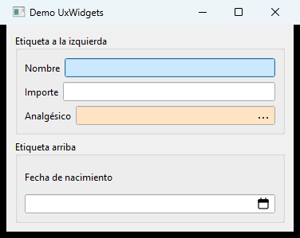
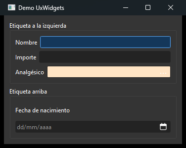

<div align="center">

# UxWidgets

**Reusable Qt Widgets controls for data-entry forms.**

A configurable composite input control -- label + typed field + icon -- in a
single line of code, with validation, active-field highlighting, and properties
ready for Designer.

[](LICENSE)


</div>

<div align="center">

| Light theme | Dark theme |
|:---:|:---:|
|  |  |

<sub>The focused field is highlighted in blue (light or dark depending on the theme); required empty fields are highlighted in bisque.</sub>

</div>

---

`UxWidgets` packages the "label + field + icon" pattern repeated throughout desktop
application forms. Instead of creating, aligning, and validating three widgets for
each value, place **one** control that already knows how to behave as text, a number,
or a date. It also includes a non-editable label, a label + combo box composite
for values that are shown or selected rather than typed, and a check box with
theme-aware focus highlighting and a read-only mode.

## ✨ Features

- 🧩 **Composite control** -- label, field, and icon as a single unit; the label can
  be placed to the left or above.
- 🔤 **Three typed variants** -- text (with maximum length and uppercase), number
  (integer/decimal digits and thousands separator), and date (`dd/MM/yyyy`).
- 🔽 **Combo composite** -- `UxComboInput` pairs a label with a `QComboBox` using the
  same left/above placement.
- 🔒 **Non-editable label** -- `UxLabel` shows read-only text with alignment,
  optional image, hover highlight, and fill-with-dots.
- ☑️ **Check box** -- `UxCheck` highlights its background while focused (theme-aware),
  shows a distinct text color while checked, and offers a `readOnly` mode that
  ignores user toggles while keeping its normal look.
- 📅 **Empty-tolerant date** -- built on `QLineEdit`, it accepts an empty field when
  not required (something `QDateEdit` does not naturally allow) and provides a popup
  calendar.
- 🔎 **Built-in selection button** -- an icon inside the field opens your selection
  dialog; you decide what to show and what to return.
- 🎯 **Active-field highlighting** -- the focused field tints its background with a
  **theme-aware** color (light/dark), updated when the theme changes at runtime.
- ⚠️ **Required-field warning** -- visual feedback when a mandatory field is empty.
- 🎛️ **Fully configurable with `Q_PROPERTY`** -- ready for a future Qt Designer
  plugin without redesigning the controls.
- 📦 **No dependencies** beyond Qt 6 and C++17.

## 🧱 Control Anatomy

```
   ┌──────────────────────────────────────────────┐
  │  UxInput  (a single control to place)        │
   │  ┌─────────┐ ┌──────────────────┐ ┌────────┐ │
  │  │  Label  │ │    text field    │ │   …    │ │
   │  └─────────┘ └──────────────────┘ └────────┘ │
  │    QLabel        UxField            selector │
   └──────────────────────────────────────────────┘
```

Two-layer architecture: controls inherit from standard Qt widgets.

```
              QLineEdit                              QWidget
                  │                                     │
            ┌─────┴─────┐                        ┌──────┴──────┐
            │  UxField  │  (common)              │   UxInput   │  (composite)
            └─────┬─────┘                        │ QLabel +    │
       ┌───────────┼───────────┐                  │ UxField* +  │
     UxTextField UxNumberField UxDateField           │ layout      │
                                                 └──────┬──────┘
                                           ┌────────────┼────────────┐
                                      UxTextInput  UxNumberInput  UxDateInput
```

- **Field layer** (`UxField : QLineEdit`): shared behavior (selection button,
  required state, focus highlighting) plus validation for each type.
- **Composite layer** (`UxInput : QWidget`): label + field + layout and property
  forwarding. The `Ux{Text,Number,Date}Input` convenience classes create the
  appropriate field type.

Outside the typed-field layer, the library also ships three standalone controls:
`UxLabel : QLabel` (non-editable label), `UxComboInput : QWidget` (label +
`QComboBox`), and `UxCheck : QCheckBox` (check box with focus highlighting,
distinct checked text, and a read-only mode).

## 📋 Requirements

- **Qt 6** (Core, Gui, Widgets)
- **C++17**
- **CMake ≥ 3.21**
- **Ninja** (recomendado como generador)

Tested on Windows with Qt 6 and MinGW, and on Linux with Qt 6, GCC, CMake, and
Ninja. Self-contained demo deployment with `windeployqt` is Windows-specific.

On Fedora, RHEL, CentOS Stream, and Oracle Linux distributions, install the
development environment with:

```bash
sudo dnf install qt6-qtbase-devel qt6-qttools cmake ninja-build gcc-c++
```

## 🚀 Quick Start

Add the library to your CMake project and link its target:

```cmake
add_subdirectory(path/to/UxWidgets)
target_link_libraries(MyApp PRIVATE UxWidgets::UxWidgets)
```

```cpp
#include <UxWidgets/UxTextInput.h>
#include <UxWidgets/UxNumberInput.h>
#include <UxWidgets/UxDateInput.h>
#include <UxWidgets/UxComboInput.h>
#include <UxWidgets/UxCheck.h>
#include <UxWidgets/UxLabel.h>
```

When using it as a dependency, disable the demo:

```cmake
set(UXWIDGETS_BUILD_DEMO OFF)
add_subdirectory(path/to/UxWidgets)
```

## 💡 Examples

```cpp
// Uppercase text, maximum length, and a required field
auto *name = new UxTextInput("Name");
name->textField()->setUppercase(true);
name->setMaxLength(30);
name->setRequired(true);

// Amount: 6 integer digits, 2 decimal digits, thousands separator
auto *amount = new UxNumberInput("Amount");
amount->numberField()->setIntegerDigits(6);
amount->numberField()->setDecimalDigits(2);
amount->numberField()->setThousandsSeparator(true);

// Date with the label above (allows empty values)
auto *date = new UxDateInput("Date");
date->setLabelPosition(UxInput::Above);

// Combo box composite: label + QComboBox, label on the left
auto *sex = new UxComboInput("Sex");
sex->comboBox()->addItem("Female");
sex->comboBox()->addItem("Male");

// Non-editable label: read-only text, selectable, with a hover highlight
auto *code = new UxLabel("Patient code: 12345");
code->setTextInteractionFlags(Qt::TextSelectableByMouse);

auto *details = new UxLabel("Show details");
details->setHighlight(true);
connect(details, &UxLabel::clicked, this, [] { /* open the details view */ });

// Check box with a read-only, pre-verified flag
auto *notify = new UxCheck("Notify by phone");
auto *verified = new UxCheck("Verified");
verified->setChecked(true);
verified->setReadOnly(true);
```

## 🧭 Control Catalog

| Control | Inherits | Purpose |
|---|---|---|
| `UxTextField` | `UxField` | Free text. `maxLength` and `uppercase`. |
| `UxNumberField` | `UxField` | Numeric only. `integerDigits`, `decimalDigits`, `thousandsSeparator`; right-aligned. |
| `UxDateField` | `UxField` | `dd/MM/yyyy` date; allows empty values; popup calendar. |
| `UxInput` | `QWidget` | Composite label + field + icon. `labelText`, `labelPosition`. |
| `UxTextInput` · `UxNumberInput` · `UxDateInput` | `UxInput` | Convenience classes that create the corresponding field type. |
| `UxComboInput` | `QWidget` | Composite label + `QComboBox`. `labelText`, `labelPosition`; the combo is exposed via `comboBox()`. |
| `UxLabel` | `QLabel` | Non-editable label. `multiline`, `highlight`, `highlightColor`, `fillWithDots`, `image`; emits `clicked()`. |
| `UxCheck` | `QCheckBox` | Check box. Focus background tint (theme-aware), distinct text color while checked, `readOnly` mode that keeps the normal look. |

<details>
<summary><b>Properties (<code>Q_PROPERTY</code>)</b></summary>

All configurable properties are declared as `Q_PROPERTY` (and enums with `Q_ENUM`),
so that a future Qt Designer plugin can expose them.

| Class | Properties |
|---|---|
| `UxField` | `required`, `showSelector`, `icon`, `lightFocusColor`, `darkFocusColor` |
| `UxTextField` | `uppercase` (+ `maxLength` inherited from `QLineEdit`) |
| `UxNumberField` | `integerDigits`, `decimalDigits`, `thousandsSeparator` |
| `UxInput` | `labelText`, `labelPosition` (`Left` \| `Above`), `text`, `maxLength`, `required` |
| `UxComboInput` | `labelText`, `labelPosition` (`Left` \| `Above`) |
| `UxLabel` | `multiline`, `highlight`, `highlightColor`, `fillWithDots`, `image` |
| `UxCheck` | `readOnly` |

</details>

## 🔎 The Selection Button

The icon at the end of the field **does not search or select on its own**: clicking
it emits `selectionRequested()`. Your code decides what to open (usually a modal
selection dialog) and what to return to the field:

```cpp
auto *article = new UxTextInput("Article");
article->textField()->setShowSelector(true);   // trailing "..." icon
connect(article, &UxInput::selectionRequested, this, [=] {
  // Open your selection dialog and, upon acceptance:
    article->setText(selectedValue);
});
```

In `UxDateField`, the always-visible icon is a calendar that opens a
`QCalendarWidget` and writes the selected date.

## 🛠️ Build the Library and Demo

### Linux

Qt installed from distribution packages is detected automatically:

```bash
cmake -S . -B build-linux -G Ninja -DCMAKE_BUILD_TYPE=Debug
cmake --build build-linux
./build-linux/demo/UxWidgetsDemo
```

In a graphical session, the final command starts the demo. To distribute a Qt
application on Linux, use the distribution's packaging mechanism or a compatible
deployment tool, since this project does not package it.

### Windows

```bash
cmake -S . -B build -G Ninja -DCMAKE_PREFIX_PATH=<qt-path>/mingw_64
cmake --build build
./build/demo/UxWidgetsDemo
```

The `UXWIDGETS_BUILD_DEMO` option (ON by default) builds `UxWidgetsDemo`, an app
that exercises the controls. On Windows, a `POST_BUILD` step runs
`windeployqt` and copies Qt DLLs and MinGW runtimes next to the executable, so it
can launch by double-clicking without Qt in `PATH`.

## 🗺️ Roadmap

- [ ] **Qt Designer** plugin that exposes controls and their properties in the palette.
- [ ] **Theme-aware** required-field warning (currently uses a fixed light color).
- [ ] New controls following the same pattern (radio button, grid, etc.).
- [ ] Installable package (`find_package(UxWidgets)`) in addition to `add_subdirectory`.

## 📄 License

UxWidgets is distributed under the **MIT** license (see [`LICENSE`](LICENSE)): you
may use, copy, modify, and redistribute it freely while retaining the copyright
notice.

This library **depends on Qt** but does not include it. Qt is distributed under its
own license (**LGPLv3** in its open-source edition, or a commercial license). If you
build and **distribute a binary** that links Qt, you must comply with the Qt LGPL:
link Qt dynamically (as the demo does with Qt DLLs), include the Qt license text, and
state where its source code can be obtained. That compliance is the responsibility of
the person building and distributing the final application, not this source-code
repository. More information at <https://www.qt.io/licensing>.
